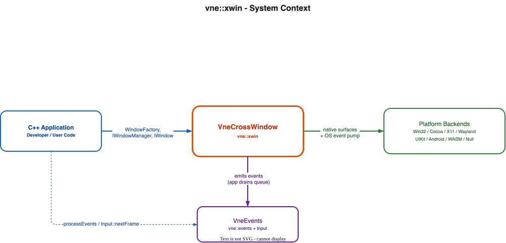
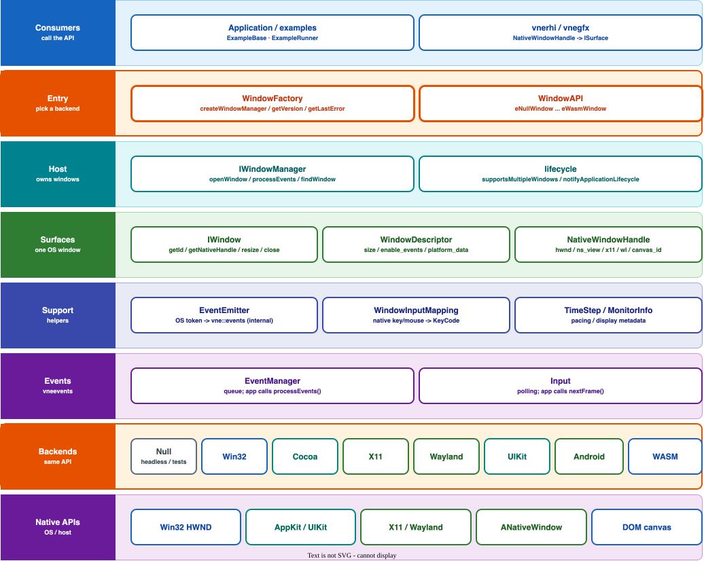
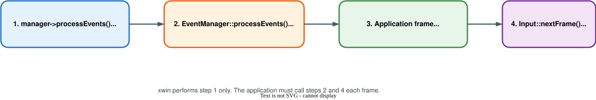

# Window System

## Overview

VneCrossWindow (`vne::xwin`) provides cross-platform **native window surfaces** for the VertexNova ecosystem without GLFW. It owns window lifecycle, platform event pumping, and native handles for an external renderer (Vulkan, Metal, DirectX, WebGPU, and so on). Presentation is not owned by xwin — `swapBuffers()` is often a no-op when GL/context ownership lives elsewhere.



**Figure 1: Context Diagram**

| Element | Description |
|---------|-------------|
| C++ Application | Creates a manager via `WindowFactory`, opens windows, drains `vne::events` / polls `Input` |
| VneCrossWindow (`vne::xwin`) | Factory, manager, and window abstractions over OS backends |
| Platform backends | Win32, Cocoa, X11, Wayland, UIKit, Android, WASM, Null |
| VneEvents (`vne::events` / `Input`) | Typed event queue and input polling; xwin emits, the app drains |

## Architecture

The window system follows a layered architecture with clear separation of concerns:

```
Window System (vne::xwin)
├── WindowFactory              # Selects backend and constructs IWindowManager
├── IWindowManager             # Owns windows; pumps OS events; lifecycle notify
├── IWindow                    # One native surface; WindowId; NativeWindowHandle
├── WindowDescriptor           # Creation-time settings (size, flags, enable_events/input)
├── NativeWindowHandle         # Per-API handles for RHI / swapchain wiring
├── Supporting types
│   ├── WindowAPI / modes / limits / ApplicationLifecycle
│   ├── MonitorInfo
│   ├── WindowInputMapping     # Native key/mouse ↔ vne::events codes
│   └── TimeStep               # Frame pacing helper for poll loops
└── Platform backends (implementation)
    ├── Null, Win32, Cocoa, X11, Wayland, UIKit, Android, WASM
```



**Figure 2: Class Diagram**

| Element | Description |
|---------|-------------|
| WindowFactory | Static entry: `createWindowManager()`, version/build/error helpers |
| IWindowManager | `openWindow`, `processEvents`, primary/focused, `findWindow(WindowId)` |
| IWindow | Surface API; `getId()`, `getNativeHandle()`, geometry/mode |
| WindowDescriptor | Title, size, decoration, `enable_events` / `enable_input`, `platform_data` |
| NativeWindowHandle | HWND / NSView / UIView / X11 / Wayland / ANativeWindow / `canvas_id` |
| Backends | Concrete managers/windows selected at compile/link time |

### Key Design Principles

- **No GLFW** — first-party backends selected by factory and CMake feature flags
- **Events live in vneevents** — xwin only pumps the OS and emits; the application must call `EventManager::processEvents()` and `Input::nextFrame()`
- **WindowId routing** — every window-scoped event is stamped with a process-unique id; use `findWindow` for multi-window listeners
- **Main-thread affinity** — AppKit/UIKit (and typically other backends) require event-thread calls
- **Rendering is external** — wire swapchains from `NativeWindowHandle`; do not expect GL swap from xwin
- **Optional capabilities** — clipboard, icon, monitors, DPI, transparency may be no-ops on some backends; check behavior per platform

## Core Components

### WindowFactory - Backend Selection

Static entry point that constructs an `IWindowManager` for the auto-selected or explicit `WindowAPI`.

**Key Features:**

- **Auto-select** via `createWindowManager()` (see [Factory selection order](#factory-selection-order))
- **Explicit API** via `createWindowManager(WindowAPI)` or with a properties string
- **Diagnostics** — `getVersion()`, `getBuildInfo()`, `getLastError()`, `isAvailable()`, `clearLastError()`
- **Null fallback** — if the preferred backend fails and the null backend is compiled in, the factory may fall back to `NullWindowManager`

### IWindowManager - Multi-Window Host

Owns the set of `IWindow` instances and pumps platform events.

**Key Features:**

- **Lifecycle** — `initialize` / `shutdown` / `isInitialized`
- **Windows** — `openWindow`, `removeWindow`, `destroyAllWindows`, primary/focused, `findWindow`
- **Multi-window** — `supportsMultipleWindows()`; ask before offering multi-window UI
- **Event pump** — `processEvents()` fills the `vne::events` queue only (does not dispatch or advance Input)
- **Application lifecycle** — `notifyApplicationLifecycle` (static, process-scoped, no window id)
- **Close queries** — `shouldClose` / `shouldCloseAll`
- **Platform info** — `getWindowAPI`, `getPlatformInfo`, `isFeatureSupported`
- **Timing** — `getCurrentTime`, `getPlatformTime`, `sleep`
- **Monitors** — optional; default implementations return empty/zero

### IWindow - Native Surface

Platform window abstraction for one surface.

**Key Features:**

- **Lifecycle** — `initialize` (managers call this; `IWindow::create` already initializes), `pollEvents`, `close`, `isOpen`
- **Presentation** — `swapBuffers` may be a no-op when context ownership is external
- **Geometry / mode** — title, resize, position, fullscreen/mode, minimize/maximize/restore
- **WindowId** — `getId()`; never reused; stamped on emitted events
- **Native handle** — `getNativeHandle()` for RHI
- **Optional defaults** — limits, cursor, monitor, DPI, framebuffer size, transparency, VSync, clipboard, icon (inline no-ops on the base)

### WindowDescriptor - Creation Settings

Creation-time configuration passed to `openWindow`.

**Key Features:**

- Title, size, position, mode/state/visibility
- `resizable`, `decorated`, `always_on_top`, `vsync_enabled`, transparency, cursor, limits
- `graphics_backend` — hint only; presentation remains external
- `platform_data` / `platform_data_size` — UIKit scene, Android `ANativeWindow`, and similar host pointers
- `enable_events` / `enable_input` — gate EventManager queue vs Input polling mirrors
- Optional `input_mapping` for custom native ↔ events maps

### NativeWindowHandle - RHI Wiring

Per-API fields for swapchain / surface creation:

| Backend | Primary fields |
|---------|----------------|
| Win32 | `hwnd` |
| Cocoa | `ns_view`, `ns_window` |
| UIKit | `ui_view`, `ui_window`, `ca_layer` |
| X11 | `x11_display`, `x11_window_id` (optional XCB fields) |
| Wayland | `wl_display`, `wl_surface` |
| Android | `a_native_window` |
| WASM | `canvas_id` |
| Null | empty / `eNullWindow` |

### Supporting Types

- **`xwin_types.h`** — `WindowAPI`, modes, `TouchPhase`, `ApplicationLifecycle`, geometry structs
- **`MonitorInfo`** — name, bounds, work area, DPI, primary, refresh rate
- **`WindowInputMapping`** — built-in Win32/Cocoa/X11/Wayland tables; UIKit touch-first; Android often omits KM tables
- **`TimeStep`** — target FPS, delta clamp/smoothing, optional sleep pacing, render gating

## API Reference

### WindowAPI

| Enumerator | Role |
|------------|------|
| `eNullWindow` | Headless / tests / CI smoke |
| `eWin32Window` | Windows HWND |
| `eCocoaWindow` | macOS AppKit |
| `eX11Window` | Linux X11 |
| `eWaylandWindow` | Linux Wayland (opt-in CMake) |
| `eIosUikitWindow` | iOS / visionOS / tvOS UIKit |
| `eAndroidSurfaceWindow` | Android `ANativeWindow` |
| `eWasmWindow` | Emscripten canvas host |

### Factory selection order

`WindowFactory::createWindowManager()` picks the best compiled-in API in roughly this order:

1. WASM (Emscripten builds)
2. Win32
3. Android
4. UIKit
5. Cocoa
6. Linux: prefer `WAYLAND_DISPLAY` when Wayland is enabled, else `DISPLAY` / X11
7. Null (fallback when nothing else applies, or when preferred creation fails and null is available)

### Key WindowDescriptor fields

| Field | Default / notes |
|-------|-----------------|
| `title` | `"VneXWin"` |
| `size` | 800×600 |
| `enable_events` | `true` — emit into EventManager |
| `enable_input` | `true` — mirror into Input polling state |
| `platform_data` | Host-provided scene/surface pointer when required |
| `input_mapping` | Optional custom mapping |

### Feature strings (`isFeatureSupported`)

Best-effort and backend-specific. Common strings include `resize`, `dpi`, `fullscreen`, `clipboard`, `canvas`, `multi_window`, `uikit`, `native_window`. Treat as advisory — prefer `supportsMultipleWindows()` for multi-window capability checks.

## Event and Input Bridge



**Figure 3: Per-frame Event Loop**

| Step | Call | Responsibility |
|------|------|----------------|
| 1 | `manager->processEvents()` | Pump OS; emit into `vne::events` queue |
| 2 | `EventManager::instance().processEvents()` | Dispatch queued events to listeners |
| 3 | Application frame / simulate | `onFrame`, game logic, etc. |
| 4 | `Input::nextFrame()` | Advance polling edge detection |

xwin does **not** call steps 2 or 4. Forgetting them is the usual cause of “events never fire” or stuck keys.

`IWindowManager::notifyApplicationLifecycle` emits process-scoped pause/resume/low-memory events (no window id). Hosts (iOS scene delegate, Android activity, browser visibility) inject these.

Cross-reference:

- [Event System](../../../deps/internal/vneevents/docs/events/events.md)
- [Input System](../../../deps/internal/vneevents/docs/input/input.md)

## Platforms

| Backend | `WindowAPI` | Multi-window | Notes |
|---------|-------------|--------------|-------|
| Null | `eNullWindow` | N/A | Always available for tests; examples smoke-exit without `onInit` |
| Win32 | `eWin32Window` | Yes | `hwnd` |
| Cocoa | `eCocoaWindow` | Yes | Main-thread AppKit |
| X11 | `eX11Window` | Yes | Optional XCB handle fields |
| Wayland | `eWaylandWindow` | Yes | Opt-in: `VNE_XWIN_ENABLE_WAYLAND` |
| UIKit | `eIosUikitWindow` | Typically one scene | Pass scene/host via `platform_data` |
| Android | `eAndroidSurfaceWindow` | One surface | `ANativeWindow` via `platform_data` |
| WASM | `eWasmWindow` | When host shell provides panels | Canvas id; multi-panel `#vne-desktop` shell |

CMake toggles live under `src/vertexnova/xwin/CMakeLists.txt` (`VNE_XWIN_ENABLE_*`). Wayland is opt-in; other desktop backends follow the host OS.

## Usage Examples

### Minimal loop

```cpp
#include <vertexnova/xwin/window_factory.h>
#include <vertexnova/xwin/window_descriptor.h>
#include <vertexnova/events/events.h>

int main() {
    auto manager = vne::xwin::WindowFactory::createWindowManager();
    if (!manager || !manager->initialize()) {
        return 1;
    }

    vne::xwin::WindowDescriptor desc("Hello xwin", 800, 600);
    auto window = manager->openWindow(desc);
    if (!window) {
        manager->shutdown();
        return 1;
    }

    while (window->isOpen() && !manager->shouldCloseAll()) {
        manager->processEvents();
        vne::events::EventManager::instance().processEvents();
        // simulate / render using window->getNativeHandle()
        vne::events::Input::nextFrame();
    }

    manager->destroyAllWindows();
    manager->shutdown();
    return 0;
}
```

### Multi-window routing

```cpp
void onEvent(const vne::events::Event& event, vne::xwin::IWindowManager& mgr) {
    if (auto w = mgr.findWindow(event.windowId())) {
        // Handle event for this window (title, close child vs primary, etc.)
        (void)w;
    }
}
```

Ask `manager->supportsMultipleWindows()` (and on WASM, `isFeatureSupported("multi_window")`) before opening children.

### Built-in examples

See [examples/README.md](../../../examples/README.md):

| Example | Demonstrates |
|---------|--------------|
| `example_01_hello_xwin` | Factory, version/build info, open a window |
| `example_02_xwin_events` | Key/mouse/touch/window/lifecycle + Input polling |
| `example_03_multi_window` | Open/focus/close children; WindowId routing |

Link CMake consumers with `vne::xwin` (`target_link_libraries(... PRIVATE vne::xwin)`).

## Performance Considerations

- Call `processEvents` once per frame; avoid nested pumps that re-enter UI toolkits
- Drain `EventManager` every frame so the queue does not grow unbounded
- Use `TimeStep` for target FPS, delta clamping, and optional sleep pacing on desktop poll loops
- Prefer category filters / typed listeners in vneevents for high-frequency mouse move traffic
- Keep handlers short; defer heavy work outside the event callback

## Best Practices

- **Thread affinity** — drive windows from the main/event thread (required for AppKit/UIKit)
- **Descriptor flags** — disable `enable_events` / `enable_input` only when you intentionally want silence
- **WindowId** — route with `event.windowId()` + `findWindow`; do not cache raw pointers across remove
- **Primary vs children** — exit the app on primary close (or ESC); allow children to close independently
- **Native handles** — treat UIKit/Android pointers as non-owning; do not release what the backend owns
- **Lifecycle** — on `eLowMemory`, release caches; mobile hosts may terminate apps that ignore it
- **Capability checks** — use `supportsMultipleWindows()` before multi-window UI

## Troubleshooting

### Common Issues

#### No window / blank CI run

- CI and headless runs often select the **null** backend; examples perform a smoke cycle and skip `onInit`
- Check `WindowFactory::getLastError()` and `window->getWindowAPI()`
- Ensure the desired backend is compiled in (`VNE_XWIN_ENABLE_*`)

#### Events never received

- Confirm `descriptor.enable_events == true`
- Call `manager->processEvents()` **and** `EventManager::instance().processEvents()` each frame
- Verify listeners are registered for the expected `EventType`

#### Input polling stuck / edges wrong

- Call `Input::nextFrame()` once after simulation each frame
- Confirm `enable_input` is true

#### Wayland not used on Linux

- Wayland is opt-in (`VNE_XWIN_ENABLE_WAYLAND`)
- Prefer `WAYLAND_DISPLAY` set; otherwise factory may select X11 via `DISPLAY`

#### WASM canvas / multi-window

- Ensure the HTML host exposes the expected canvas / `#vne-desktop` shell (see example template)
- Multi-window requires the VNE shell; check `isFeatureSupported("multi_window")`

#### Link / find_package errors

- Link `vne::xwin` and ensure internal deps (`vnecommon`, `vnelogging`, `vneevents`) are available
- For installed shared builds, use the generated `VneXWinTargets.cmake`

## Related Documentation

- [Examples guide](../../../examples/README.md) — build/run examples and multi-window checklist
- [Testing strategy](../../TESTING.md) — unit tests, CI, smoke vs desktop validation
- [Docs hub / Doxygen](../../README.md) — generate API docs
- [Event System](../../../deps/internal/vneevents/docs/events/events.md) — event types and listeners
- [Input System](../../../deps/internal/vneevents/docs/input/input.md) — polling and frame edges
- Public headers under `include/vertexnova/xwin/`

## Version History

- **v1.9.0**: Architecture documentation for `vne::xwin` (factory, manager, windows, platforms, event loop)

---

_This documentation is maintained with the codebase. For the latest information, see the source code and generated API documentation._
